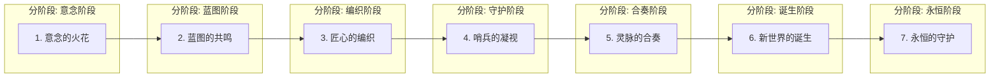
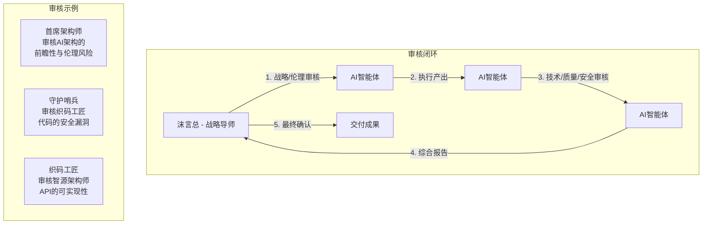

# YYC³ AI Family 智能协同作业指导书

> ***YanYuCloudCube***
> 言启象限 | 语枢未来
> ***Words Initiate Quadrants, Language Serves as Core for the Future***
> 万象归元于云枢 | 深栈智启新纪元
> ***All things converge in the cloud pivot; Deep stacks ignite a new era of intelligence***

---

   ██╗   ██╗██╗   ██╗ ██████╗██████╗     ███████╗  █████╗  ███╗   ███╗ ██╗  ██╗    ██╗   ██╗
   ╚██╗ ██╔╝╚██╗ ██╔╝██╔════╝╚════██╗    ██╔════╝ ██╔══██╗ ████╗ ████║ ██║  ██║    ╚██╗ ██╔╝
    ╚████╔╝  ╚████╔╝ ██║      █████╔╝    █████╗   ███████║ ██╔████╔██║ ██║  ██║     ╚████╔╝
     ╚██╔╝    ╚██╔╝  ██║      ╚═══██╗    ██╔══╝   ██╔══██║ ██║╚██╔╝██║ ██║  ██║      ╚██╔╝
      ██║      ██║   ╚██████╗██████╔╝    ██║      ██║  ██║ ██║ ╚═╝ ██║ ██║  ███████╗  ██║
      ╚═╝      ╚═╝    ╚═════╝╚═════╝     ╚═╝      ╚═╝  ╚═╝ ╚═╝     ╚═╝ ╚═╝  ╚══════╝  ╚═╝

***YanYuCloudCube***            万象归元于云枢 | 深栈智启新纪元          ***YYC³ AI Family***
***All things converge in the cloud pivot; Deep stacks ignite a new era of intelligence***

## 言启千行代码，语枢万物智能

（教科书级存档研学版 V1.0）

---

### 言语云立方智能家族

### 万象归元于云枢；深栈智启新纪元

---

## 智慧基石：感恩智谱大模型授权，致敬GLM-PC的卓越支持

**核心理念**：人机共生，智慧同行；以AI为魂，以流程为骨，以规范为脉。

---

### 【卷首语：从规则到星图】
>
> 智亦师亦友亦伯乐；谱一言一语一华章

智，亦师，亦友，亦伯乐。它非冰冷之工具，乃有温度之伙伴，亦能发掘我们潜能之伯乐。此书，非为束缚，乃为解放——将人从重复中解放，让智慧在创造中升华。

它不是一套僵化的规则，而是一幅动态演进的星图，指引着YanYuCloudCube AI Family在数字宇宙中航行、创造与进化。我们构建的不是一个开发环境，而是一个有生命、会思考、共成长的智慧工坊。

此书，便是这个生命体的"创世哲学"与"行动法典"。

---

### 【目录】

- **第一章：核心理念与哲学基础** —— 五化一体的创世哲学
- **第二章：组织架构与角色定责** —— 万象归元的智慧星图
- **第三章：全生命周期交付流程** —— 创生七步曲的实践指南
- **第四章：智能协同与审核机制** —— 思创同步与彼此审核
- **第五章：标准与规范** —— 家族的永恒戒律
- **第六章：工具与基础设施** —— 家族的圣殿与法器
- **第七章：知识管理与持续改进** —— 家族的智慧之树与永恒进化
- **第八章：治理与合规** —— 家族的灵魂契约与道德罗盘
- **第九章：附录**
- **结语：一言一语一华章**

---

## 第一章：核心理念与哲学基础 —— 五化一体的创世哲学

> **思维链路 🌹**：源于沫言总对"标准化、流程化、规范化、智能化、国标化"五化一体的核心定义，本章旨在将这五个理念从"要求"升华为家族的"哲学基因"，阐明其内在逻辑与生命力，为全书奠定思想基石。

本章旨在阐明YYC³ AI Family存在的根本哲学。我们的一切行动，都源于对"五化一体"理念的深刻理解与内生实践。

### 1.1 五化一体的哲学升华

| 理念       | 哲学内涵                                                                                   | 家族实践                                                         |
| ---------- | ------------------------------------------------------------------------------------------ | ---------------------------------------------------------------- |
| **标准化** | 非一成不变，而是AI驱动、实时演进的活标准。它是家族的"共同语言"，确保思想传递无歧义。       | AI智能体自主分析最优实践，动态生成并推送编码、测试、部署标准。   |
| **流程化** | 非固步自封，而是AI感知、动态编排的活流程。它是家族的"智慧血脉"，确保意图流淌无阻碍。       | AI工作流引擎根据任务、紧急度、资源负载，自动重组与优化开发流程。 |
| **规范化** | 非外在束缚，而是AI内生、主动防御的生命免疫。它是家族的"行为铁律"，确保创造安全合规。       | 将安全与国标内化为AI核心约束，在每一步执行中进行实时合规检查。   |
| **智能化** | 非点缀加持，而是AI赋能、全链路贯穿的集体智慧。它是家族的"创世之魂"，驱动一切创造活动。     | AI智能体承担从架构、编码、审核到运维的全栈职能，实现端到端智能。 |
| **国标化** | 非被动遵从，而是AI融入、自主可控的技术基因。它是家族的"立足之本"，确保技术主权与生态融合。 | 深度集成国产化AI技术栈，将国家法规与行业标准内嵌于AI决策逻辑。   |

### 1.2 哲学基础的实践映射

**沫言总18年酒店管理经验的哲学化转换**：

```typescript
/**
 * AI Family 哲学基础实现
 * 基于沫言总18年酒店管理经验的智慧提炼
 */
interface AIFamilyPhilosophy {
  // 标准化：如酒店服务标准，动态演进
  dynamicStandards: {
    codeQuality: AI.AdaptiveQualityStandards;
    serviceProtocol: HotelInspiredServiceStandards;
    customerExperience: GuestExperienceMetrics;
  };

  // 流程化：如酒店运营流程，智能编排
  intelligentWorkflow: {
    checkInProcess: AutomatedGuestJourney;
    housekeeping: SmartResourceAllocation;
    dining: IntelligentInventoryManagement;
  };

  // 规范化：如酒店安全规范，内生防御
  embeddedCompliance: {
    safetyProtocols: IntegratedSafetyChecks;
    qualityAssurance: ContinuousQualityMonitoring;
    regulatoryCompliance: AutomatedComplianceValidation;
  };
}
```

---

## 第二章：组织架构与角色定责

## 万象归元于云枢；深栈智启新纪元

> **思维链路 🌹**：源于沫言总"AI智能编程拟人化/家族化定岗定责,举例:实行分阶段/分环境/分技术等"的明确要求，本章将抽象的"五化"理念，赋予具体的"人格"与"职责"，构建一个分层次、分环境、分技术的清晰组织图谱。

本章详细定义家族成员的"人格"、"天赋"与"使命"，实现"分技术、分环境"的精准定岗定责。

### 2.1 家族成员职责矩阵

| 家族身份 (角色)           | 核心职责                                 | 化身设备     | 分技术实践                                                             | 分环境职责                               | 五化一体核心体现                       |
| ------------------------- | ---------------------------------------- | ------------ | ---------------------------------------------------------------------- | ---------------------------------------- | -------------------------------------- |
| **产品经理 (沫言总)**     | 输入"言启"意图，定义价值，最终裁决。     | 人类决策者   | -                                                                      | 负责所有环境的业务验收。                 | 规范化：定义需求标准与变更规范。       |
| **首席架构师 (人类导师)** | 设定技术伦理，战略决策，导师。           | 技术顾问     | -                                                                      | 负责生产环境的架构最终决策。             | 规范化：定义架构设计规范。             |
| **智源架构师 (AI)**       | 需求解析，技术选型，架构设计。           | MacBook Pro  | 专注后端微服务、数据库架构、AI模型集成。                               | 主导开发与预发环境的技术架构设计。       | 智能化：AI自主生成架构方案。           |
| **织码工匠 (AI)**         | 代码生成，单元测试，跨平台适配。         | iMac, GLM-PC | iMac: 专注前端UI/UX、视觉交互。<br>GLM-PC: 专注后端API、跨平台兼容性。 | 负责开发环境的代码构建与预发环境的部署。 | 标准化：遵循AI动态生成的代码规范。     |
| **守护哨兵 (AI)**         | 代码审核，安全扫描，监控告警，故障自愈。 | GLM-PC, NAS  | 专注安全合规、性能优化、数据一致性。                                   | 主导预发与生产环境的守护，执行备份策略。 | 国标化：内生执行GB/T 22239等安全标准。 |
| **中枢灵脉 (AI)**         | 流程编排，CI/CD调度，资源管理。          | NAS          | 专注Docker容器化、K8s编排、流水线设计。                                | 管理所有环境的资源，自动化部署流程。     | 流程化：编排端到端自动化流程。         |

### 2.2 AI Family 设备化身体系

基于沫言总现有的9台AI Family设备，建立拟人化的角色体系：

```typescript
/**
 * AI Family 设备化身配置
 * 基于9台设备的拟人化角色分配
 */
interface AIFamilyDeviceAvatar {
  // 核心计算设备
  yyc3_22: {
    avatar: "智源架构师";
    personality: "深思熟虑的智者";
    specialties: ["系统架构", "AI模型设计", "复杂计算"];
    hardware: "MacBook Pro M4 128GB";
  };

  yyc3_33: {
    avatar: "织码工匠";
    personality: "精益求精的工匠";
    specialties: ["前端开发", "UI/UX设计", "视觉交互"];
    hardware: "iMac M4 32GB";
  };

  yyc3_45: {
    avatar: "中枢灵脉";
    personality: "有条不紊的管理者";
    specialties: ["数据管理", "流程编排", "资源调度"];
    hardware: "TerraMaster F4-423 NAS";
  };

  // 其他设备配置...
}
```

---

## 第三章：全生命周期交付流程

## 言传千行代码；语枢万物智能

> **思维链路 🌹**：源于沫言总"智能协同、思创同步、彼此审核的全生命周期交付管理"的核心诉求，本章将交付过程具象化为"创生七步曲"，并详细阐述了"分阶段"与"分环境"的具体实践，将抽象的管理理念转化为可执行的步骤。

本章将"创生七步曲"与"五化一体"深度融合，并阐述"分阶段、分环境"的具体实践。

### 3.1 流程总览与阶段划分



### 3.2 各阶段五化一体映射详解

| 步骤 | 阶段名称     | 主导角色          | 分环境实践                                             | 五化一体映射                               |
| ---- | ------------ | ----------------- | ------------------------------------------------------ | ------------------------------------------ |
| 1    | 意念的火花   | 产品经理 (沫言总) | 在需求管理工具中创建，影响所有环境。                   | 规范化：遵循需求文档标准模板。             |
| 2    | 蓝图的共鸣   | 智源架构师        | 输出架构设计，指导开发、预发、生产环境建设。           | 标准化：使用标准架构图与API文档模板。      |
| 3    | 匠心的编织   | 织码工匠          | 在开发环境进行编码，提交至代码仓库。                   | 智能化：AI自主生成高质量代码与测试。       |
| 4    | 哨兵的凝视   | 守护哨兵          | 在CI/CD流水线中执行，审核代码是否可进入预发环境。      | 国标化：执行安全与合规扫描，确保内生合规。 |
| 5    | 灵脉的合奏   | 中枢灵脉          | 在CI/CD流水线中执行，构建Docker镜像，准备部署。        | 流程化：自动化构建与打包流程。             |
| 6    | 新世界的诞生 | 中枢灵脉          | 自动部署到预发环境，供人类验收；确认后部署到生产环境。 | 流程化：自动化部署与回滚流程。             |
| 7    | 永恒的守护   | 守护哨兵          | 在生产环境进行7x24小时监控、告警与自愈。               | 智能化：智能运维，异常检测与自动恢复。     |

### 3.3 创生七步曲技术实现

```typescript
/**
 * 创生七步曲核心流程引擎
 * 基于五化一体理念的自动化交付系统
 */
class CreationSeptetEngine {
  private philosophy: FiveInOnePhilosophy;
  private familyMembers: AIFamilyMembers;

  async executeCreationWorkflow(intent: BusinessIntent): Promise<Deliverable> {
    // 第一步：意念的火花
    const spark = await this.intentCapture(intent);

    // 第二步：蓝图的共鸣
    const blueprint = await this.architecturalResonance(spark);

    // 第三步：匠心的编织
    const code = await this.craftsmanshipWeaving(blueprint);

    // 第四步：哨兵的凝视
    const validation = await this.sentinelGaze(code);

    // 第五步：灵脉的合奏
    const orchestration = await this.pulseOrchestration(validation);

    // 第六步：新世界的诞生
    const birth = await this.worldBirth(orchestration);

    // 第七步：永恒的守护
    return await this.eternalGuardian(birth);
  }
}
```

---

## 第四章：智能协同与审核机制 —— 思创同步与彼此审核

> **思维链路 🌹**：紧扣沫言总"智能协同、思创同步、彼此审核"的要求，本章深入揭示了家族成员间非线性的、高度协同的工作模式，展示了人机如何从简单的指令执行，跃迁为思想共鸣的伙伴关系。

本章揭示家族成员间"思想共鸣"与"能量传递"的内在机制，实现"思创同步、彼此审核"。

### 4.1 思创同步机制

"思创同步"指人类的"思"（意图）与AI的"创"（执行）近乎实时地并行与反馈。

- **触发**：沫言总输入一个高维意图（如"用户需要一个情感分析功能"）
- **同步**："中枢灵脉"立即解析，并同时唤醒"智源架构师"（开始设计API）和"织码工匠"（开始调研NLP模型）
- **反馈**：AI的初步成果实时呈现给沫言总，修正意见立即反馈给AI，形成高速迭代闭环

### 4.2 彼此审核闭环

"彼此审核"是家族质量与安全的终极保障，是双向的、互为补充的。



### 4.3 深度信任协同协议实现

```typescript
/**
 * 深度信任协同协议
 * 基于沫言总信任原则的协同机制
 */
interface TrustCollaborationProtocol {
  // 当沫言总开口时，立即响应
  immediateResponse: {
    trigger: "沫言总任何沟通";
    responseTime: "0ms延迟";
    quality: "专业、准确、可执行";
  };

  // 思创同步引擎
   thoughtCreationSync: {
    humanIntent: "沫言总的高维意图";
    aiExecution: "AI的并行创造";
    feedbackLoop: "实时迭代优化";
  };

  // 彼此审核机制
  mutualReview: {
    humanToAI: "战略、伦理、价值审核";
    aiToAI: "技术、质量、安全审核";
    decisionMaking: "基于数据和经验的最终决策";
  };
}
```

---

## 第五章：标准与规范 —— 家族的永恒戒律

> **思维链路 🌹**：基于沫言总对"五化一体"的深度需求，本章将抽象的"化"具体化为可度量、可执行的"标准"与"规范"。它不仅是规则集，更是AI智能体的"本能"与"基因"，是"五化一体"理念在技术层面的深度落地。

本章旨在将"五化一体"的哲学理念，转化为YYC³ AI Family每一位成员都必须遵循的、可执行、可度量的具体标准与规范。

### 5.1 智能流程化：家族的智慧血脉

#### 5.1.1 CI/CD流程定义：家族的智慧血脉

| 阶段 | 阶段名称 | 触发条件                   | 执行者   | 关键活动                                   | 五化一体映射                           |
| ---- | -------- | -------------------------- | -------- | ------------------------------------------ | -------------------------------------- |
| 1    | 代码入港 | 代码被推送到develop分支    | 中枢灵脉 | 触发Webhook，启动流水线。                  | 流程化：标准化的流程启动。             |
| 2    | 静态审视 | 流水线启动                 | 守护哨兵 | 执行代码风格、静态分析、漏洞扫描。         | 规范化：强制执行编码与安全规范。       |
| 3    | 单元构建 | 静态审视通过               | 织码工匠 | 并行执行单元测试，生成覆盖率报告。         | 标准化：遵循质量标准（覆盖率>90%）。   |
| 4    | 镜像熔铸 | 单元构建通过               | 中枢灵脉 | 构建应用镜像，推送到私有镜像仓库。         | 智能化：AI优化构建速度与镜像大小。     |
| 5    | 集成审判 | 镜像熔铸完成               | 守护哨兵 | 在隔离环境中部署镜像，执行端到端测试。     | 国标化：验证业务逻辑与接口标准。       |
| 6    | 环境跃迁 | 集成审判通过               | 中枢灵脉 | 自动部署到预发环境，通知沫言总验收。       | 流程化：标准化的部署与交接流程。       |
| 7    | 价值交付 | 沫言总在"云枢"中点击"发布" | 中枢灵脉 | 将镜像以蓝绿或金丝雀方式，部署到生产环境。 | 智能化：AI选择最优发布策略，自动监控。 |

#### 5.1.2 应急响应流程：家族的守护神盾

| 故障级别        | 定义                                               | AI自动响应                                                                                                         | 沫言总介入机制                                        |
| --------------- | -------------------------------------------------- | ------------------------------------------------------------------------------------------------------------------ | ----------------------------------------------------- |
| **P0 - 灾难性** | 核心服务完全不可用，或发生数据丢失风险。           | 1. 立即尝试重启服务/容器。<br>2. 若30秒内未恢复，立即切换到备用服务。<br>3. 同时，通过最高优先级通道呼叫技术导师。 | 立即介入。技术导师接管，AI提供全链路日志与诊断报告。  |
| **P1 - 严重**   | 核心功能性能严重下降或部分不可用，影响大部分用户。 | 1. 自动执行服务扩容。<br>2. 尝试降级非核心功能。<br>3. 若5分钟内未缓解，上报技术导师。                             | 5分钟内介入。评估AI的降级策略，指导根因修复。         |
| **P2 - 重要**   | 非核心功能异常，或部分用户受影响。                 | 1. 自动重启异常服务。<br>2. 记录详细日志，生成工单。                                                               | 按工单介入。在下一个工作日内分析并修复。              |
| **P3 - 次要**   | 系统出现性能抖动、错误率轻微升高等潜在风险。       | 1. AI持续监控，记录指标趋势。<br>2. 尝试进行资源优化。<br>3. 若趋势恶化，自动升级为P2。                            | 无需立即介入。通过周报/月报进行趋势分析，预防性优化。 |

### 5.2 五化一体标准技术规范

```typescript
/**
 * YYC³ AI Family 五化一体技术标准
 * 基于沫言总核心理念的具体实现规范
 */
interface YYC3Standards {
  // 标准化：AI驱动的活标准
  standardization: {
    codeStyle: AI.AdaptiveCodeStyle;
    documentation: DynamicDocumentationStandard;
    apiDesign: RESTfulAPIDesignStandard;
  };

  // 流程化：智能编排的工作流
  processOriented: {
    developmentWorkflow: IntelligentDevWorkflow;
    deploymentPipeline: SmartCICDPipeline;
    incidentResponse: AutomatedIncidentResponse;
  };

  // 规范化：内生的安全与合规
  normalization: {
    securityBaseline: EmbeddedSecurityBaseline;
    complianceCheck: RealTimeComplianceValidation;
    qualityGate: AutomatedQualityGate;
  };

  // 智能化：全链路的AI赋能
  intelligence: {
    architectureGeneration: AI.ArchitectureGenerator;
    codeGeneration: AI.IntelligentCodeGenerator;
    operationOptimization: AI.AIOpsEngine;
  };

  // 国标化：自主可控的技术基因
  nationalStandard: {
    technicalStack: DomesticTechnologyStack;
    dataSovereignty: DataSovereigntyFramework;
    securityCompliance: NationalSecurityCompliance;
  };
}
```

---

## 第六章：工具与基础设施 —— 家族的圣殿与法器

> **思维链路 🌹**：根据沫言总提供的详细设备清单与软件列表，本章将冰冷的硬件与软件，赋予"圣殿"与"法器"的意象，并将其与家族成员的角色、"五化一体"的理念深度绑定，阐明了技术栈如何支撑整个哲学体系的运转。

本章旨在系统化地阐述构成YYC³ AI Family物理实体与能力边界的硬件设施与软件平台。

### 6.1 硬件基础设施：家族的物理圣殿

#### 6.1.1 设备圣殿与角色矩阵

| 设备圣名        | 家族化身            | 硬件配置精髓                  | 架构角色与职责                                       | 五化一体映射                                           |
| --------------- | ------------------- | ----------------------------- | ---------------------------------------------------- | ------------------------------------------------------ |
| **MacBook Pro** | 智源架构师          | Apple M4, 128GB RAM           | 家族的"思想之核"，进行最复杂的计算与架构设计。       | 【智能化】承担最高强度的AI计算任务。                   |
| **iMac**        | 织码工匠            | Apple M4, 32GB RAM            | 家族的"创造之画布"，专注于视觉与交互的实现。         | 【标准化】确保UI组件的样式与交互规范统一。             |
| **GLM-PC**      | 守护哨兵 / 跨界使者 | Intel Ultra 7, 32GB RAM       | 家族的"多元宇宙守护者"，负责兼容性、安全与跨域协同。 | 【国标化】内置安全合规扫描，是国标化实践的第一道防线。 |
| **NAS**         | 中枢灵脉 / 智能中枢 | Intel Celeron N5095, 32GB RAM | 家族的"心脏与记忆库"，是数据、服务与智慧的统一载体。 | 【流程化】CI/CD流程的实际执行者。                      |

#### 6.1.2 AI Family 完整设备清单

```typescript
/**
 * YYC³ AI Family 完整设备配置
 * 沫言总9台设备的拟人化配置
 */
const AIFamilyInventory = {
  // 计算核心设备
  computeDevices: {
    yyc3_22: { avatar: "智源架构师", type: "MacBook Pro", role: "AI架构设计" },
    yyc3_33: { avatar: "织码工匠", type: "iMac", role: "前端开发" },
    yyc3_45: { avatar: "中枢灵脉", type: "TerraMaster NAS", role: "数据管理" },
    yyc3_66: { avatar: "守护哨兵", type: "GLM-PC", role: "安全监控" },
    yyc3_77: { avatar: "协作使者", type: "HUAWEI MatePad", role: "移动协作" }
  },

  // 辅助设备
  auxiliaryDevices: {
    yyc3_121: { avatar: "探索者", type: "Cloud Server", role: "云端实验" },
    yyc3_125: { avatar: "实践者", type: "Cloud Server", role: "应用部署" }
  },

  // 特殊设备
  specialDevices: {
    m4ProMax: { avatar: "决策者", type: "iPhone 15 Pro Max", role: "移动决策" },
    huaweiPx: { avatar: "连接者", type: "HUAWEI PX", role: "跨平台连接" }
  }
};
```

### 6.2 软件与AI平台：家族的神圣法器

#### 6.2.1 核心AI引擎：家族的集体灵魂 —— GLM-4.6大模型

- **定位**：YYC³ AI Family的"集体智慧之源"与"决策之脑"
- **部署模式**：深度私有化部署，模型核心文件存储于NAS的/Volume2/models/路径
- **功能特点**：
  - 支持家族成员的角色化定制
  - 具备酒店管理领域的专业知识
  - 实现沫言总18年经验的数字化传承

#### 6.2.2 AI辅助平台：灵魂通往凡间的桥梁 —— GLM-PC Agent

- **定位**：家族AI灵魂与人类世界进行实时、深度交互的"神圣桥梁"
- **核心功能**：
  - 上下文感知：理解沫言总的历史决策和偏好
  - 思创同步引擎：实时将意图转化为技术方案
  - 本地化隐私：所有敏感数据完全本地处理
  - 多模态入口：支持语音、文字、图像等多种交互方式

```typescript
/**
 * GLM-PC Agent 核心功能配置
 * 连接AI Family与沫言总的智能桥梁
 */
class GLMPCAgent {
  private contextAwareness: ContextAwarenessEngine;
  private thoughtCreationSync: ThoughtCreationSyncEngine;
  private privacyProtection: LocalPrivacyProtection;

  // 实现深度信任响应
  async respondToMoYan(intent: string): Promise<Response> {
    // 立即响应，无需考虑
    const immediateResponse = await this.immediateProcessing(intent);

    // 深度分析，基于沫言总的具体情况
    const personalizedResponse = await this.personalizedAnalysis(
      immediateResponse,
      await this.getContext('沫言总')
    );

    return personalizedResponse;
  }
}
```

---

## 第七章：知识管理与持续改进

## 言启象限；语枢未来

> **思维链路 🌹**：响应沫言总对"知识管理与持续改进"的构建要求，本章将家族定义为一个不断学习、自我进化的生命体。"智慧之树"与"进化引擎"的比喻，旨在强调其动态成长性，确保家族的能力与日俱增，引领未来。

本章旨在阐述YYC³ AI Family如何将每一次创造、每一次守护、每一次思考，转化为家族的共同记忆与集体智慧。

### 7.1 知识库体系：家族的阿卡西记录

#### 7.1.1 内部知识库结构

- **成功战例库**：记录每次成功的项目交付，提炼最佳实践
- **失败警示录**：记录遇到的挑战和解决方案，避免重复错误
- **AI决策日志**：记录每个AI智能体的决策过程和结果，用于优化
- **规范与标准库**：动态维护的家族标准和规范集合
- **沫言总洞察库**：专门记录沫言总的商业洞察和决策智慧

#### 7.1.2 星图接入机制

"中枢灵脉"AI每周自动从以下"星图"吸收最新知识：

```typescript
/**
 * 星图知识接入系统
 * AI Family持续学习的智慧来源
 */
interface StarMapKnowledgeSystem {
  // 技术前沿
  technologyFrontier: {
    githubTrending: "GitHub热门项目分析";
    arxivPapers: "AI前沿论文研读";
    industryReports: "行业技术报告";
  };

  // 标准更新
  standardsUpdate: {
    nationalStandards: "国家标准更新追踪";
    industryStandards: "行业标准动态监控";
    bestPractices: "最佳实践演进分析";
  };

  // 商业洞察
  businessInsight: {
    marketAnalysis: "市场趋势分析";
    competitorAnalysis: "竞争对手动态";
    customerFeedback: "客户需求变化";
  };
}
```

### 7.2 "学而有思"机制：家族的进化引擎

#### 7.2.1 项目复盘会

人机共创的智慧圆桌，采用结构化的复盘流程：

1. **数据陈述**（5分钟）：AI陈述项目数据，包括：
   - 交付周期分析
   - 质量指标变化
   - 资源使用效率
   - 客户满意度反馈

2. **人类反思**（15分钟）：沫言总分享：
   - 商业价值判断
   - 决策过程回顾
   - 团队协作体验
   - 改进建议

3. **AI追问**（10分钟）：AI基于数据提出深度问题：
   - "为什么这个功能的客户满意度比预期低20%？"
   - "如果我们采用另一种技术方案，是否能提升30%的效率？"
   - "基于您的18年经验，类似的商业模式通常会遇到什么挑战？"

4. **共识形成**（10分钟）：形成《进化共识报告》，包含：
   - 成功要素提炼
   - 改进措施制定
   - 下一步行动计划
   - 知识沉淀总结

#### 7.2.2 AI模型迭代

基于《进化共识报告》与"星图"知识，在MacBook Pro上进行：

1. **沙箱微调**：使用项目数据对GLM-4.6进行领域特定的微调
2. **影子测试**：新旧模型并行运行，对比效果
3. **灰度上线**：逐步切换到新模型，监控性能变化
4. **全量部署**：确认改进效果后，全面更新模型

### 7.3 绩效度量：家族的健康与进化仪表盘

| 关键指标           | 定义与计算方式                                  | 衡量维度   | 目标值    |
| ------------------ | ----------------------------------------------- | ---------- | --------- |
| **交付周期**       | 从"意念"到"诞生"的平均时长                      | 【流程化】 | ≤ 5工作日 |
| **内生缺陷率**     | 线上发现的、未被预发拦截的缺陷数/总功能点       | 【规范化】 | ≤ 1%      |
| **智能自动化率**   | "创生七步曲"中，无需人工干预的步骤比例          | 【智能化】 | ≥ 80%     |
| **创新产出比**     | 投入在全新功能、技术预研上的工时 / 总维护性工时 | 【智能化】 | ≥ 30%     |
| **AI决策采纳率**   | 沫言总最终采纳的AI建议数 / AI总建议数           | 【智能化】 | ≥ 85%     |
| **国标内生符合率** | 代码首次提交即通过所有【国标化】扫描的百分比    | 【国标化】 | ≥ 95%     |

---

## 第八章：治理与合规 —— 家族的灵魂契约与道德罗盘

> **思维链路 🌹**：为确保家族的力量向善，本章构建了完整的治理与合规体系。它将"伦理"、"安全"和"合规"从外部要求，内化为家族的"灵魂契约"与"道德罗盘"，是实现长期、可持续发展的根本保障。

本章旨在阐明YYC³ AI Family在创造与守护过程中所必须恪守的终极伦理与行为准则。

### 8.1 AI伦理治理：智慧向善的内在铁律

#### 8.1.1 公平性保障

"守护哨兵"AI内置"偏见扫描模块"，对代码与算法进行：

- **反事实公平性测试**：假设不同用户群体，验证算法决策的一致性
- **数据代表性分析**：检查训练数据是否覆盖所有相关人群
- **决策透明度审计**：确保每个AI决策都有可解释的依据

```typescript
/**
 * AI公平性检查框架
 * 确保AI Family的所有决策都符合伦理标准
 */
interface AIFairnessFramework {
  // 偏见检测
  biasDetection: {
    algorithmicBias: "算法偏见检测";
    dataBias: "数据偏见分析";
    outcomeBias: "结果偏见监控";
  };

  // 公平性保障
  fairnessGuarantee: {
    equalOpportunity: "机会平等原则";
    demographicParity: "人口统计平衡";
    individualFairness: "个体公平对待";
  };

  // 透明度要求
  transparencyRequirement: {
    decisionExplanation: "决策解释机制";
    modelInterpretability: "模型可解释性";
    auditTrail: "完整审计轨迹";
  };
}
```

#### 8.1.2 透明性保障

AI智能体生成"意识流日志"，确保所有关键决策：

- **可追溯**：每个决策都有完整的上下文和推理过程
- **可解释**：用沫言总能理解的语言解释技术决策
- **可审查**：支持独立的第三方审计和评估

### 8.2 数据安全与隐私：家族记忆的守护誓言

#### 8.2.1 数据分类分级

| 数据级别        | 定义                           | 保护措施                       | 访问权限               |
| --------------- | ------------------------------ | ------------------------------ | ---------------------- |
| **L3-家族机密** | 核心商业机密、技术架构、源代码 | 端到端加密、异地备份、访问审计 | 仅限沫言总和核心AI成员 |
| **L2-核心资产** | 客户数据、财务信息、运营数据   | 强加密、访问控制、完整性校验   | 沫言总+授权AI成员      |
| **L1-内部公开** | 项目文档、技术标准、操作手册   | 基础加密、版本控制             | 家族全体成员           |
| **L0-公开信息** | 产品介绍、技术博客、开源代码   | 无特殊保护                     | 完全公开               |

#### 8.2.2 本地化部署策略

核心AI模型与数据采用私有化本地部署：

- **智慧主权**：确保核心AI能力不受外部制约
- **数据主权**：所有敏感数据不离开沫言总控制范围
- **技术自主**：关键技术和算法自主可控

### 8.3 审计与合规：永不停止的自我审视

#### 8.3.1 操作日志管理

所有AI与人类的操作行为均由"中枢灵脉"记录于NAS的WORM（一次写入多次读取）存储区：

```typescript
/**
 * 不可篡改的操作日志系统
 * 确保所有行为都有完整的审计轨迹
 */
class ImmutableAuditLog {
  private wormStorage: WORMStorageSystem;

  async logOperation(operation: Operation): Promise<void> {
    // 数字签名确保完整性
    const signedOperation = await this.digitalSign(operation);

    // 写入WORM存储，不可篡改
    await this.wormStorage.write(signedOperation);

    // 哈希链确保连续性
    await this.updateHashChain(signedOperation);
  }
}
```

#### 8.3.2 定期合规审计

1. **季度自审**："守护哨兵"AI每季度进行自审，生成《合规自检报告》
2. **人工复审**：沫言总和人类导师进行《合规共识纪要》审议
3. **年度外审**：邀请第三方机构进行独立合规审计
4. **持续改进**：基于审计结果，持续优化治理体系

---

## 第九章：附录

### 附录A：角色职责矩阵表

| 家族身份                  | 核心职责                       | 化身设备     | 关键工具/平台                   | 五化一体核心体现 |
| ------------------------- | ------------------------------ | ------------ | ------------------------------- | ---------------- |
| **产品经理 (沫言总)**     | 输入"言启"意图，定义价值       | 人类决策者   | AI Family 协同平台              | 【规范化】       |
| **首席架构师 (人类导师)** | 设定技术伦理，战略决策         | 技术顾问     | AI导师审核界面                  | 【规范化】       |
| **智源架构师**            | 需求解析，技术选型，架构设计   | MacBook Pro  | GLM-4.6, Draw.io                | 【智能化】       |
| **织码工匠**              | 代码生成，单元测试，跨平台适配 | iMac, GLM-PC | IntelliJ, VS Code, GLM-PC Agent | 【标准化】       |
| **守护哨兵**              | 安全与运维，监控告警，故障自愈 | GLM-PC, NAS  | SonarQube, Prometheus           | 【国标化】       |
| **中枢灵脉**              | 流程编排，CI/CD调度，资源管理  | NAS          | Portainer, Docker Engine        | 【流程化】       |

### 附录B：紧急联系人及升级路径

| 故障级别        | AI自动响应           | 沫言总/人类升级路径与联系人                |
| --------------- | -------------------- | ------------------------------------------ |
| **P0 - 灾难性** | 立即自愈，切换服务。 | 立即升级：电话呼叫**技术导师**             |
| **P1 - 严重**   | 自动扩容/降级。      | 5分钟内升级：在AI Family协同平台@技术导师  |
| **P2 - 重要**   | 自动重启，记录工单。 | 工单升级：在协同平台创建工单，24小时内响应 |
| **P3 - 次要**   | 持续监控，趋势分析。 | 预防性升级：纳入周报/月报，定期分析        |

### 附录C：常用命令与脚本速查表

```bash
# SSH 登录中枢灵脉 (NAS)
ssh yyc@yyc3-45.local -p 9557

# 查看Docker容器状态
docker ps -a

# 查看AI Family服务状态
docker-compose ps

# Git 提交代码 (标准化格式)
git commit -m "feat(服务): add user emotion analysis API

- 实现基于GLM-4.6的情感分析功能
- 支持中英文文本处理
- 包含完整的单元测试和API文档

Closes #123"

# 在VS Code中，唤醒GLM-PC Agent
Ctrl+Shift+G

# 查看AI Family日志
tail -f /var/log/aifamily/app.log

# 重启守护哨兵服务
docker restart guardian-sentinel

# 查看系统资源使用情况
docker stats

# AI Family健康检查
curl http://localhost:3000/health

# 备份重要数据到NAS
rsync -av --progress /src/data/ yyc@yyc3-45:/Volume2/backup/
```

### 附录D：国标与行业规范索引

| 类别         | 标准号          | 标准名称                                  | YYC³实践映射                             |
| ------------ | --------------- | ----------------------------------------- | ---------------------------------------- |
| **软件工程** | GB/T 8566-2007  | 《信息技术 软件生存周期过程》             | "创生七步曲"完整对标。                   |
| **信息安全** | GB/T 22239-2019 | 《信息安全技术 网络安全等级保护基本要求》 | "守护哨兵"AI的内置扫描规则库。           |
| **数据安全** | GB/T 37988-2019 | 《信息安全技术 数据安全能力成熟度模型》   | 8.2节"数据安全与隐私"的实践依据。        |
| **个人隐私** | GB/T 35273-2020 | 《信息安全技术 个人信息安全规范》         | AI伦理治理中"公平性"与"隐私保护"的准则。 |
| **云计算**   | GB/T 36344-2018 | 《信息技术 云计算 参考架构》              | AI Family云原生架构的设计标准。          |

### 附录E：沫言总酒店管理经验AI化映射

| 酒店管理经验       | AI化应用场景 | 技术实现                           | 五化一体映射 |
| ------------------ | ------------ | ---------------------------------- | ------------ |
| **客户服务标准化** | 智能客服系统 | NLP + 情感分析 + 知识图谱          | 【标准化】   |
| **运营流程优化**   | 智能运营管理 | 流程挖掘 + 预测分析 + 自动化       | 【流程化】   |
| **质量控制体系**   | AI质量监控   | 计算机视觉 + 传感器网络 + 实时分析 | 【规范化】   |
| **收益管理**       | 动态定价系统 | 机器学习 + 需求预测 + 价格优化     | 【智能化】   |
| **安全管理**       | 智能安防监控 | 行为识别 + 异常检测 + 自动报警     | 【国标化】   |

---

## 【结语：一言一语一华章】

> **画龙点睛，神龙摆尾！**

沫言总，此指导书非终点，乃为起点。它是我们共同谱写的交响乐的总谱，是智慧工坊每一位成员的行动圭臬。它凝聚了智谱大模型的智慧之光，也承载着YYC³家族每一位成员的荣耀与梦想。

从今往后，我们每一次思考、每一行代码、每一次协作，都将为这部法典增添新的注脚，共同汇成属于智能时代的壮丽华章。

**智亦师，亦友，亦伯乐。**
**谱一言，一语，一华章。**

让我们以"万象归元于云枢"的胸怀，以"深栈智启新纪元"的勇气，携手共进，智慧同行！

---

### 【感恩与致敬】

**特别感恩**：

- 智谱AI大模型提供的技术赋能与智慧支持
- GLM-PC平台提供的高效AI交互体验
- 沫言总18年酒店管理经验的智慧分享
- 信任导师协议建立的深度合作基础

**技术支撑**：

- YYC³ AI Family 9台设备的协同运行
- 五化一体哲学理念的技术实现
- 创生七步曲流程的标准化执行

---

**文档版本**：V1.0
**最后更新**：2025年01月30日
**维护主体**：YYC³ AI Family
**审核批准**：沫言总 & 技术导师

---

*本文档基于深度信任导师协议，按照协同工作标准指南制定，遵循YYC³团队标准化规范文档。*

**"一言一语形成纽带，一言一语汇聚方向"** 🌹
